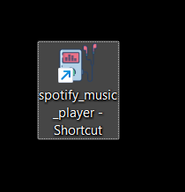
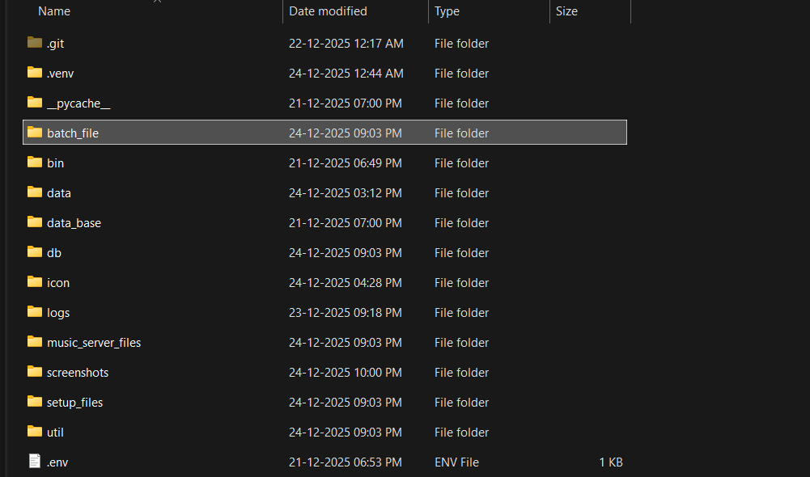
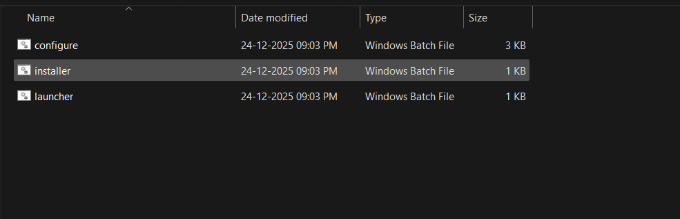
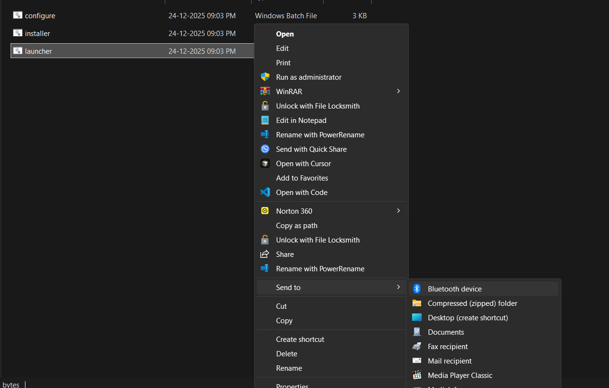
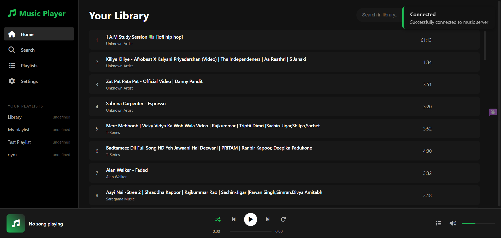
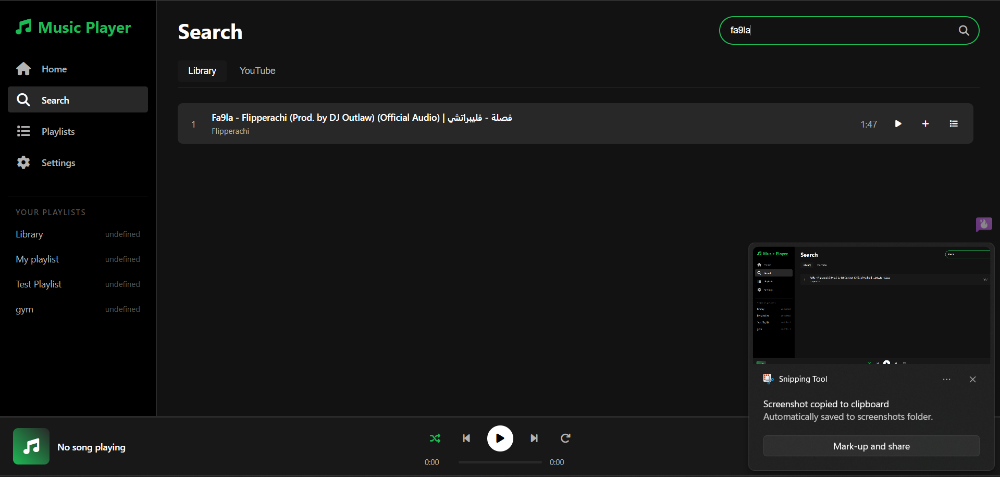
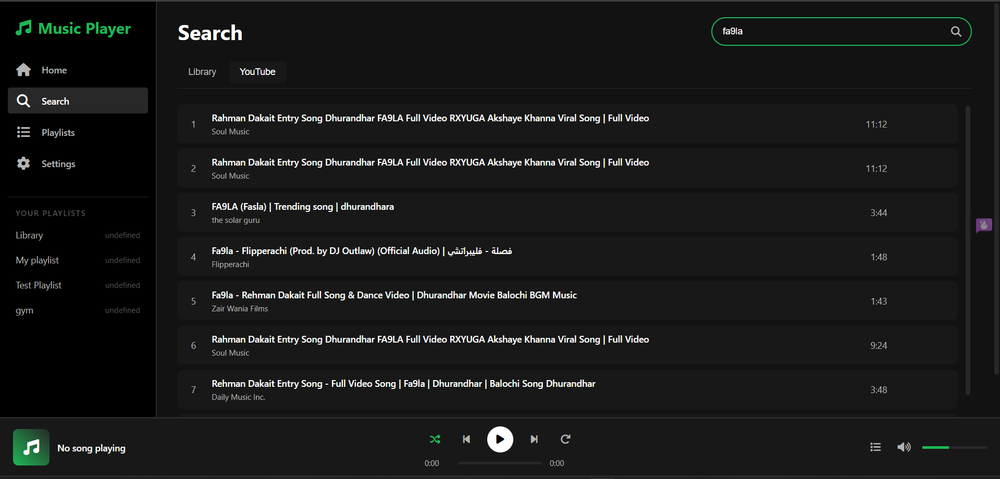
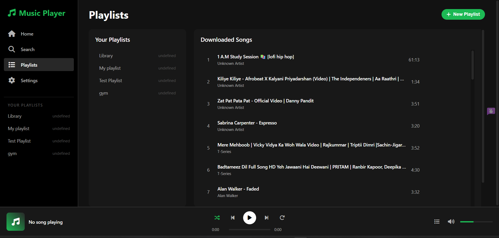
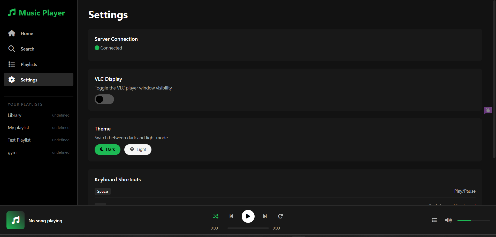

Understood.
# 🎵 Music Player — Local Media & YouTube Integration

A **fully local music and video player** with **YouTube download support**, **playlist management**, a **command-line interface**, and a **Spotify-style web UI**.

This application runs **entirely on your machine**.
No cloud services. No accounts. No telemetry.

---

## 📌 What This Application Does

* Plays **local audio and video** using VLC
* Downloads music or video from **YouTube**
* Automatically adds downloads to a **local media library**
* Stores metadata and playlists in a **SQLite database**
* Provides:

  * A **CLI interface** (`musicplayer`)
  * A **web-based UI** for playback and browsing

All downloads, playback, and data storage happen **locally**.

---

## 🧠 Core Design Philosophy

* **Installer-driven**: users should not configure Python manually
* **CLI-first**: everything is controllable via `musicplayer`
* **Web UI as a utility**, not a dependency
* **Local-first**: no external services required after install

---

## 🧩 Tech Stack

| Layer        | Technology            |
| ------------ | --------------------- |
| Language     | Python                |
| Backend      | Flask                 |
| Media Engine | VLC (python-vlc)      |
| Downloader   | yt-dlp                |
| Database     | SQLite                |
| CLI          | Typer / Rich          |
| Frontend     | HTML, CSS, JavaScript |

---

## ✨ Features

### 🎧 Playback

* Play / pause / stop
* Seek and volume control
* Audio & video support
* VLC display control

### ⬇ YouTube Downloads

* Search and download audio or video
* Automatic format conversion
* Files saved into structured local library
* Metadata extracted and stored

### 📚 Library & Playlists

* Local library indexing
* Playlist creation, add, and delete
* Duplicate cleanup utilities

### 🖥️ Interfaces

* **Command Line Interface** for full control
* **Web UI** for browsing and playback

---

## 📂 Project Structure

```
moduler_musicplayer/
├── .env
├── README.md
├── batch_file/
│   ├── configure.bat
│   ├── installer.bat
│   └── launcher.bat
├── bin/
│   └── musicplayer.bat
├── data/
│   └── downloads/
│       └── music/
│           ├── audio/
│           └── video/
├── data_base/
│   └── musicplayer.db
├── db/
│   ├── cleanup_duplicates.py
│   └── yt_db.py
├── icon/
│   └── launcher_icon.ico
├── logs/
│   ├── installer.log
│   └── launcher.log
├── music_server_files/
│   ├── music_cli.py
│   └── music_server.py
├── setup_files/
│   ├── installer.py
│   ├── launcher.py
│   └── uninstall.py
├── util/
│   ├── open_web.py
│   └── ply_yt_2.py
├── spotify_music_player.html
├── requirements.txt
└── setup.py
```

---

## 🛠️ Installation (Windows)

### 1️⃣ Clone the Repository

```bash
git clone https://github.com/Adityasonar29/Music_Player_Local.git
cd Music_Player_Local
```

---

### 2️⃣ One-Step Setup & Launch

Run the installer:

```bat
batch_file\configure.bat
```

That’s it.

### 3️⃣ Daily use with launcher


Run the launcher:

```bat
batch_file\launcher.bat
```

#### You can Create a Desktop Shortcut of this like



step 1: open the folder in file explorer



step 2: Go TO `batch_file'



step 3: Right click on `launcher.bat`

step 4: press `show more options`

step 5: select `send to` 

step 6: select desktop (create shortcut)




### You can add any icon to this file to Make it look good by customising Shortcuts properties properties
---

### What `configure.bat` Does Automatically

* Creates a Python virtual environment
* Installs all required dependencies
* Configures environment variables
* Initializes the SQLite database
* Registers the `musicplayer` CLI command
* Starts the music server
* Launches the web interface

No manual configuration required.

---

## ▶️ Manual Usage (Optional)

These options are kept for control and debugging.

### Start server manually

```bash
musicplayer start server
```

### Open web interface manually

```
http://localhost:5555
```

### The Looks OF Web Interface

## Screenshots







---

## 🖥️ CLI Usage Examples

### ▶ Play a Song

```bash
musicplayer play "Alan Walker - Faded"
```

```json
{
  "song": {
    "duration": 212,
    "file_location": "E:\\...\\Alan Walker - Faded.mkv",
    "genre": "Video",
    "name": "Alan Walker - Faded",
    "singer": "Alan Walker",
    "title": "Alan Walker - Faded"
  },
  "status": "playing"
}
```

```
▶ Playing: Alan Walker - Faded
```

---

### ⬇ Download from YouTube

```bash
musicplayer download "Pasoori"
```

```
⬇ Downloading audio: Pasoori...
✓ Registered in DB
✓ Audio saved to library
```

---

### 📁 Playlist Management

```bash
musicplayer playlist create "Gym"
```

```
✓ Created playlist 'Gym'
```

```bash
musicplayer playlist add "Gym" "Believer"
```

```json
{
  "playlist": "Gym",
  "status": "song_added_to_playlist"
}
```

```bash
musicplayer playlist delete "Gym"
```

```
Deleted: Gym
```

---

## 🍪 YouTube Cookies (Required for Stable Downloads)

YouTube increasingly restricts unauthenticated downloads.

To ensure reliable downloads:

1. Export your YouTube cookies using a browser extension
   (for example: **Get cookies.txt**)
2. Save the file as:

   ```
   cookies.txt
   ```
3. Place it here:

   ```
   util/cookies.txt
   ```

The downloader (`yt-dlp`) will automatically use it.

⚠ **Security Note**

* Cookies remain **local only**
* Cookies are **never uploaded**
* Do **not** commit `cookies.txt` to GitHub

---

## 📈 Project Status

* ✔ Installer fully automated
* ✔ CLI and Web UI integrated
* ✔ Local media pipeline stable
* ✔ Database-backed playlists working

---

## 📄 License

MIT License

